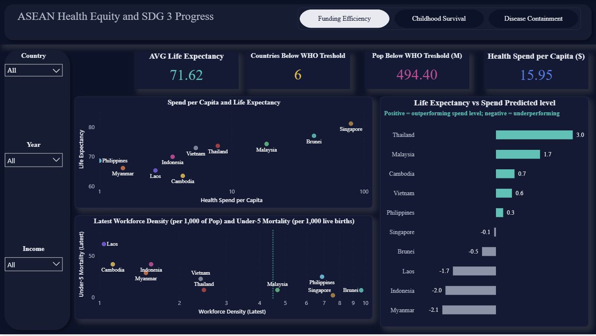
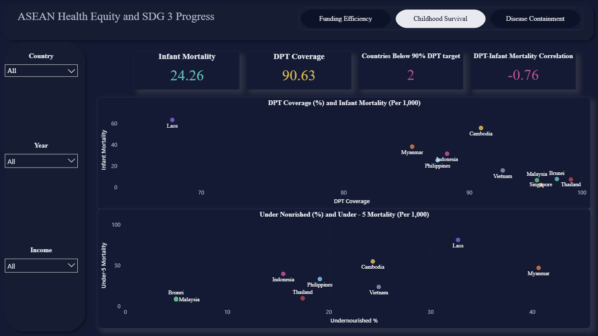
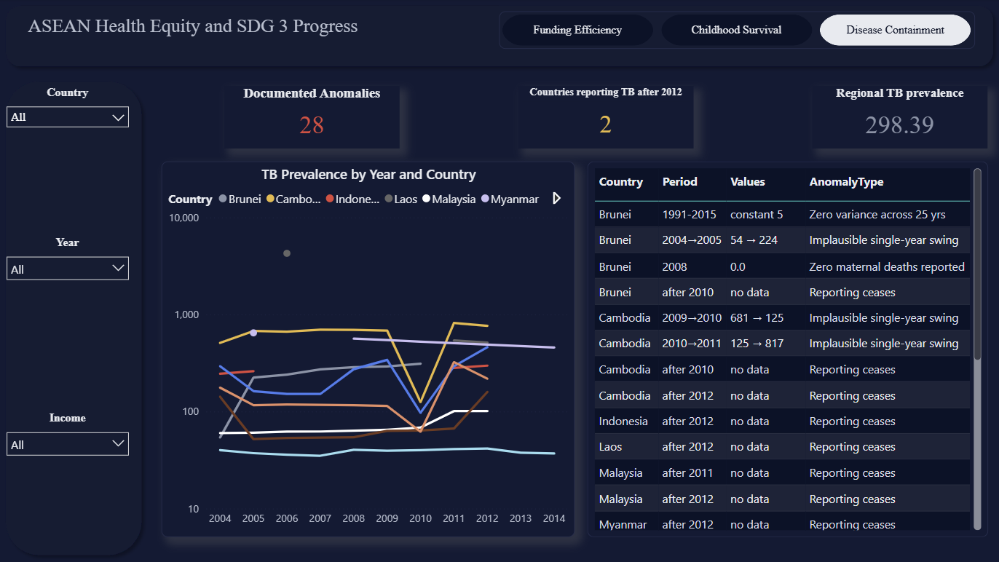

# ASEAN Health Equity & SDG 3 Progress

An interactive Power BI dashboard analysing health outcomes across the ten ASEAN
countries (1990 to 2016), built for the 10Alytics Global Hackathon 2026 as part
of the HealthTech Analytics Programme.

**[View the live interactive dashboard →](https://app.powerbi.com/view?r=eyJrIjoiMjAwMzNhMmYtNmI4ZC00MDRlLWJhNTItN2E5YWVkNjRiNjhlIiwidCI6ImZmMGYzZTNhLTNlNTMtNDU0Zi1iMmI1LTZjNjg3NTNiOGVlNCJ9)**

## What this is

Three linked findings on ASEAN health outcomes, built from 20 official WHO and
World Bank indicator files that I standardised into a single 252-row
country-year panel:

1. **Funding Efficiency.** Spend and workforce levels don't reliably predict
   outcomes. Thailand outperforms its spend-predicted life expectancy by nearly
   3 years, the largest gap in the region.
2. **Childhood Survival.** DPT vaccination coverage is the strongest predictor
   of infant mortality in the dataset (correlation -0.76). Laos and Myanmar are
   the clearest high-risk cohort.
3. **Disease Containment & Data Integrity.** Eight of ten countries have
   documented TB reporting anomalies, and only two still report past 2012.
   Containment success cannot currently be verified region-wide, which is itself
   the finding.

## The Process

This wasn't a straightforward "load data, make charts" build. It involved real
data modelling, statistical analysis outside Power BI, and catching real errors
along the way, the kind that would have undercut the whole analysis if they'd
shipped unnoticed.

### Data engineering

I cleaned and standardised 20 official WHO and World Bank indicator files
(1990 to 2016) in Python into a single 252-row country-year panel, reconciling
country-name inconsistencies across sources (Laos alone appeared under three
different spellings).

I modelled the data as a proper star schema in Power BI: one fact table
(`fact_HealthIndicators`) joined to `dim_Country` and `dim_Year`, plus standalone
reference tables (`ref_Benchmarks` for WHO and SDG thresholds, `ref_SpendEfficiency`
for regression output) deliberately left unjoined to avoid ambiguous relationship
paths.

Rather than eyeballing the data for problems, I wrote a systematic
anomaly-detection script that flagged 28 individual data-quality issues
(implausible year-on-year swings, early reporting cessation, suspected
placeholder values) and logged them as their own queryable table.

### Analysis beyond drag-and-drop

I ran a log-linear regression in Python, fitting life expectancy against
log-transformed spend per capita across all ten countries, then used it to
calculate each country's residual: how far its actual outcome sits above or
below what its spend level predicts.

Because Power BI has no built-in CORREL function, I built a Pearson correlation
coefficient from scratch in DAX to quantify the DPT-coverage-to-infant-mortality
relationship precisely rather than asserting it.

I used a recurring `LASTNONBLANK`-based DAX pattern across multiple measures to
pull each country's most recent reported year rather than an all-time average.
That was the fix for a real bug I found mid-build (below).

### Corrections I made mid-build

I found and fixed a measure that used a 27-year historical average instead of
each country's current status. The original version wrongly flagged Malaysia as
below the WHO workforce threshold, and wrongly counted 7 countries below target
instead of 6.

I replaced an early "efficiency" ranking (life expectancy divided by spend)
after realising it rewarded low spend rather than genuine performance, rebuilding
it as the regression residual measure described above.

I verified a stated correlation (initially cited as -0.85) against the actual
chart it was meant to support, found the true figure for that pairing was -0.76,
and corrected every reference across the dashboard, report, and slides, keeping
-0.85 only where it genuinely applied (DPT vs under-5 mortality, a different
pairing).

I cross-checked country-level expenditure figures directly against the live
dashboard rather than trusting an early estimate, and caught a figure that was
off by more than 50x for Singapore.

**Why this matters:** every number on this dashboard has been checked against the
underlying data at least once, and several were checked twice after something
didn't look right. The three findings below are the ones that survived that
scrutiny.

## The Findings

1. **Funding Efficiency.** Spend and workforce levels don't reliably predict
   outcomes. Thailand outperforms its own spend-predicted life expectancy by
   nearly 3 years, the largest gap in the region, while having a third of the
   Philippines' health workforce and far better child survival.
2. **Childhood Survival.** DPT vaccination coverage is the strongest predictor
   of infant mortality in the dataset (correlation -0.76, n=78). Laos and Myanmar
   are the clearest high-risk cohort on every chart tested.
3. **Disease Containment & Data Integrity.** Eight of ten countries have a
   documented TB reporting anomaly, and only two still report data past 2012.
   Containment success cannot currently be verified region-wide, which is itself
   the finding.

## Policy Recommendations

**1. Target funding at the six countries below the WHO workforce threshold,
weighted by need.** Cambodia, Indonesia, Laos, Myanmar, Thailand, and Vietnam
fall below the WHO's minimum of 4.45 health workers per 1,000 population, a
combined population of roughly 494 million people. The spend-vs-outcome
relationship shows diminishing returns at the high end, so directing funding
toward this group targets it where the workforce gap is most acute and
best-evidenced, rather than spreading it evenly across all ten countries.

**2. Scale Thailand's community health worker model regionally.** Thailand
achieves substantially better child survival than the Philippines with roughly a
third of the workforce density, backed by a network of community health
volunteers connected to the formal referral system. Training and digitally
connecting similar volunteer networks in under-threshold countries is achievable
on a far shorter timeline than training enough new doctors and nurses to close
the same gap.

**3. Mandate a common ASEAN health data reporting standard.** Eight of ten
countries have at least one documented TB reporting anomaly, and only two still
report data past 2012. A region cannot verify its own disease containment success
under these conditions. A shared reporting format and minimum-frequency
requirement, starting with TB and malaria and coordinated through the ASEAN
Public Health Task Force, would directly address this, and supports SDG 17
(cross-border data partnerships) alongside SDG 3.

## Dashboard Pages

| Page | What it shows |
| ---- | ------------- |
|  | Spend vs life expectancy, workforce density, and the regression-residual ranking |
|  | DPT coverage vs infant mortality, undernourishment vs under-5 mortality, the -0.76 correlation |
|  | TB prevalence over time and the documented reporting-anomaly log |

## Files

| File | What it is |
| ---- | ---------- |
| `Funding_Efficiency.PNG` | Dashboard page 1 |
| `Childhood_Survival.PNG` | Dashboard page 2 |
| `Disease_Containment.PNG` | Dashboard page 3 |
| `ASEAN_Health_Equity_and_SDG_3_Progress.pbix` | The full Power BI file (model, DAX measures, and visuals) |

## Tools

Power BI Desktop (Power Query, DAX, star-schema modelling), Python (pandas for
data cleaning, statsmodels for regression), WHO and World Bank indicator data.
